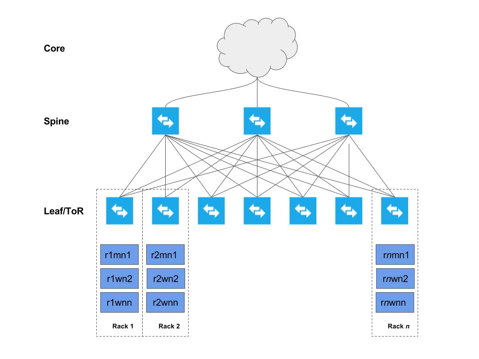

# Cloudera 裸机部署参考架构

**版权说明：** 

© 2010-2019 Cloudera, Inc. All rights reserved. 
Cloudera公司声明保留全部权利。

**版本信息：** 

Version: 6.2 Date: 20190404

**原始链接：** 

https://docs.cloudera.com/documentation/other/reference-architecture/PDF/cloudera_ref_arch_metal.pdf

**翻译作者：**

[@TopCaver](https://github.com/TopCaver)

**特别声明：**

限于译者的英语水平和技术能力，翻译中必然存在错误，请及时阅读上述链接原文。

 

| 翻译版本 | 日期       | 贡献者               | 更新说明 |
| -------- | ---------- | -------------------- | -------- |
| 1.0      | 2020-01-29 | ZhangBo（[@TopCaver](https://github.com/TopCaver)） | 新建     |

 

[TOC]

------

# 摘要

组织对大数据解决方案的需求非常简单：能够获取、整合任意数量或类型的数据，保留原始精度，统一保存管理，尽量持久保存，快速取用。

Cloudera作为一家专注企业数据管理的公司，提出了企业数据中心的概念（EDH：enterprise data hub）：使用一个中心系统用来存储和使用全部数据。EDH可以灵活应用于多种企业数据工作场景（例如：批处理，交互式SQL， 企业搜索以及高级分析），可以和企业现有系统集成，满足企业对安全性、数据治理与保护，以及管理的需求。EDH是全新的企业数据管理系统的中心。EDH构建于Cloudera Enterprise，包含Apache Hadoop开源的Cloudera发行版（CDH）、一套管理软件以及企业级支持服务。

随着企业部署基于Hadoop的大数据系统，他们同时也期望获得企业级的安全性，便捷的管理工具和强大的技术支持。这些都是Cloudera Enterprise的一部分。

Cloudera参考架构文档，以实例说明了集群和组件的配置。这些文档不能替代官方支持服务的声明条款，仅仅是指导部署和调整参数选项的指南。文档中提到的支持的配置仅供参考，应以列明引用的文档的最新版为准。

这篇文档为裸机部署Cloudera Enterprise的架构设计和最佳实践。

# 基础设施

## 系统架构最佳实践

本章介绍了Cloudera对Hadoop集群系统架构的建议以及最佳实践。

### Java

Cloudera Manager 和 CDH经过验证可以运行于Oracle JDK环境，在CM/CDH 5.16及更高的5.x版本中，也可也支持Open JDK。参考[《升级JDK》](https://www.cloudera.com/documentation/enterprise/upgrade/topics/ug_jdk8.html)以获取更多详细信息。

Cloudera发行版中包含了一个可用的Oracle JDK版本，用户也可以自行安装Oracle分发的与CDH兼容的JDK版本。

参考[《CDH和Cloudera Manger支持的JDK版本》](https://www.cloudera.com/documentation/enterprise/release-notes/topics/rn_consolidated_pcm.html%23pcm_jdk)，获取支持的JDK版本的列表。

### 划分服务器类型

Cloudera建议部署3～4种类型的服务器到生产系统中。

* **主节点（Master Node）**： 运行Hadoop重要的守护进程：NameNode， Standby NameNode，YARN Resource Manager and History Server, the HBase Master daemon, Sentry server, and the Impala StateStore Server and Catalog Server。主节点还应该部署Zookeeper和JournalNodes。守护进程通常可以共享单个服务器池资源。根据集群规模，这些角色可以分别部署在专门的服务器上。Kudu Master Servers也应该部署在主节点。

*  **工作节点（Worker Node）**：运行HDFS DataNode, YARN NodeManager, HBase RegionServer, Impala impalad, Search worker daemons and Kudu Tablet Servers.

* **工具节点（Utility Node）**：运行 Cloudera Manager 和Cloudera Management Services。可以同时部署MySQL（或其他支持的）数据库实例，数据库将会被Cloudera Manager、Hive、Sentry和其他Hadoop相关组件使用。

* **边界节点（Edge Node）**：包含所有面向客户端的配置和服务，包含HDFS、YARN、Impala、Hive和Hbase的gateway配置。边界节点同时也是部署Hue、 Oozie、 HiveServer2和Impala HA Proxy的首选位置。HiveServer2 和Impala HA Proxy可以作为网关节点向外部应用（如BI系统）提供服务。

更多信息参考，请参阅[《集群主机和角色分配建议》](https://www.cloudera.com/documentation/enterprise/latest/topics/cm_ig_host_allocations.html)。

> **提示：**
> 在小规模的集群中，边界节点和工具节点可以合并。

### 部署拓扑

下图描述了集群跨机架部署方式（机架1，机架2，……机架n）



每台主机都连接到两个机架（ToR：top of rack）交换机上，然后依次连接到一组骨干交换机，再连接至企业网络。 叶-脊网络部署模型，允许每个主机获得最大吞吐量、最小延迟和可扩展性。具体细节将在后续章节中介绍。

### 硬件列表

下表列举了部署EDH集群推荐的硬件配置

| 硬件                         | 配置                                                         | 说明                                                         | 数量                                           |
| ---------------------------- | ------------------------------------------------------------ | ------------------------------------------------------------ | ---------------------------------------------- |
| 物理服务器                   | 8～14核，>2GHz / CPU  x2   至少128G内存                      | 部署集群的各种组件                                           | 基于集群规模设计                               |
| 网卡                         | 首选10Gbps以太网卡                                           | 提供集群网络数据服务                                         | 至少每服务器一块，双网卡绑定可以提供额外的吞吐 |
| 硬盘                         | 500GB HDD或SSD用作系统盘和存储日志；  HDD用作数据盘（容量取决于数据卷需求） | 确保服务连续性。                                             | 10～24块磁盘/服务器                            |
| 以太网机架交换机（ToR/Leaf） | 至少10Gbps交换机，足够的交换端口数量以满足集群实现叶脊网络部署要求。提供大于1:4  ISL带宽（最好是1:1） | 虽然大多数企业有成熟数据网络实践经验，考虑为Hadoop集群构建一个独立的数据网络。 | 每机架两个                                     |
| 以太网骨干交换机（Spine）    | 至少10Gbps交换机，足够的接口数量，接入ISL链接，确保满足骨干吞吐量。（机架之间的流量） | 同上                                                         | 由机架数量决定                                 |

### 网络规划

***专用网络硬件***

Hadoop会消耗所有可用的网络带宽， 因此，Cloudera建议Hadoop部署在一个具有独立核心交换机的独立物理网络中。

**机架交换机**

Hadoop支持机架感知和优化，以减少网络拥塞。理想情况下，一个机架中的节点应该只连接到一个物理交换机。两个机架交换机（ToR）可提高可用性。每个机架交换机向上连接到一个核心交换。Cloudera建议在服务器和机架交换机之间，使用10GbE（或者更快）的连接。机架交换到核心交换之间的上行链路通常会被超额使用。

***上行超配额使用***

超额多少取决于网络负载。Cloudera的建议是接入交换机总带宽和上行链路带宽比尽可能达到1:1。这在ETL工作负载高的情况下非常重要，MapReduce任务也通常需要传输大量数据给Reducer。

超配比例4:1通常可以较好的应对平衡型的工作负载，但需要监控网络流量，确保上行链路带宽不是Hadoop的瓶颈。下表是一些参考：

| 接入带宽               | 上行带宽                  | 比率  |
| ---------------------- | ------------------------- | ----- |
| 48 x 1 GbE = 48 Gbps   | 4 x 10 GbE = 40 Gbps      | 1.2:1 |
| 24 x 10 GbE = 240 Gbps | 2 x 40 Gig CFP = 80 Gbps  | 3:1   |
| 48 x 10 GbE = 480 Gbps | 4 x 40 Gig CFP = 160 Gbps | 3:1   |

> **重要提示：**
>
> 切勿超过4:1比例超额使用上行链路带宽，例如如果接入交换使用20x10GbE接口，则上行链路至少应为50Gbps。 不同的交换机具有特定带宽的专用上行链路端口（通常是40Gbps或者100Gbps），因此需要仔细计划选择正确的交换机。

***冗余交换机***

在拥有冗余核心交换的Full-Mesh网络中， 任意交换机失效都不影响集群继续使用。 冗余机架交换机（ToR）可以减少因为机架交换机失效导致的整个机架的服务器计算和存储资源失效的风险。通常集群的Master节点分布于多个不同机架上的时候，在机架失效的情况下，可以维持集群的可用性。

***可访问性***

根据安全需求和工作需求，通过配置网络，对集群进行访问控制。典型的访问模型，是通过边界节点或客户端节点访问集群。 用户通过这些边界节点使用客户端应用和集群、数据进行交互。这些边缘节点可以运行Web应用、BI工具、或通过简单Hadoop命令行和HDFS交互。

Cloudera建议仅允许通过边界节点访问集群。你可以配置主机的安全组控制访问。本文的其他部分详细介绍了各种选项。

***互联网连接***

集群不需要大量的互联网访问或者外部网络访问流量，但是系统和HDFS依然需要访问软件仓库进行更新和少量外部数据源的接入。

如果完全断开与互联网的连接，会让软件更新和系统维护变得困难。

### Cloudera Manger

Cloudera建议使用Cloudera Manager（CM）安装CDH集群。通过CM安装CDH可用选择使用parcels或者原生软件包。parcel是一个二进制分发格式。Parcels提供诸多好处，包括软件一致性，灵活的安装位置， 安装无需sudo，可用减少停机时间，滚动升级和轻松降级。尽管Cloudera支持安装原生软件包，但还是建议使用parcel安装软件。

## 集群规模最佳实践

通常每个worker节点都包括若干物理磁盘作为Hadoop的原始存储。 这个数字可用于计算集群的可用存储总量。另外，下面列表计算时假设10%用于YARN临时存储。Cloudera建议分配10～25%的原始磁盘空间作为临时存储。这个配置可以通过CM进行修改，需要根据生产过程中的工作负载进行调整。 例如，对于仅有很少数据发送给reducer的MR任务，可以下调这个占比。

下表示例计算，包含17个工作节点的集群。每个服务器包含12个3TB磁盘供Hadoop使用。

**默认复制因子**

| 原始存储                            | 612 TB（17节点*12磁盘*3TB） |
| ----------------------------------- | --------------------------- |
| HDFS存储（可配置：默认10%临时存储） | 550.8 TB                    |
| HDFS 唯一存储（默认复制因子：3x）   | 183.6 TB                    |
| MR临时存储（可配置）                | 61.2 TB                     |

 

**Erasure Coding RS-6-3**

| 原始存储                                   | 612 TB   |
| ------------------------------------------ | -------- |
| HDFS存储（可配置：默认10%临时存储）        | 550.8 TB |
| HDFS 唯一存储（ES RS-6-3 – 1.5x overhead） | 367.2 TB |
| MR临时存储（可配置）                       | 61.2 TB  |

 

**Erasure Coding RS-10-4**

| 原始存储                                    | 612 TB   |
| ------------------------------------------- | -------- |
| HDFS存储（可配置：默认10%临时存储）         | 550.8 TB |
| HDFS 唯一存储（EC RS-10-4 – 1.4x overhead） | 393.4 TB |
| MR临时存储（可配置）                        | 61.2 TB  |

> **提示：**
>
> HDFS唯一存储容量，依赖于EC目录存储的数据量以及RS策略的选择。上表仅展示了不同RS策略选择如何影响HDFS的唯一存储容量。
>
> 压缩原始数据，也会提高HDFS存储容量。

CM提供了诸如静态资源池（Static Resource Pools）工具，利用Linux Cgroup来允许多个组件共享硬件资源，在生产环境中的大容量集群中，为Solr，HBase，Kafka等角色分配独立主机则更为有利。

## 集群硬件选择最佳实践

本节简要概述了不同的硬件选择对Hadoop集群性能的影响。

获取更多特定工作负载情况下的实践细节，参考[《硬件需求指南》](https://www.cloudera.com/documentation/enterprise/release-notes/topics/hardware_requirements_guide.html)。

### 磁盘数量

传统Hadoop被认为是重IO平台。虽然有许多运行在Cloudera集群中的新型应用，不再像传统MR是重IO的，但考虑IO性能依然非常有用。

不同于CPU和RAM的飞速发展，机械磁盘读取数据的速度在近10年来都没有太大的提升。[[1\]](#_ftn1)为了突破硬盘读写操作的限制，Hadoop从多个磁盘驱动器并行读写。每多一个磁轴，都会提升集群整体的读写速度。

额外的磁轴可能会导致更多了网络流量。但通常节点间的网络流量会被单个节点读写性能所限制。因此，通常还是需要更多的磁轴。

一般来说，单个节点拥有磁盘数量越多，每TB的成本就越低。但是，将太多的数据存储在单一节点上，如果节点发生故障，会导致更长的再复制（re-replication）时间。Hadoop本身是被设计成使用多节点的集群。通常多个平均的节点，要优于有少数超级节点。这还关系到数据保护以及为计算引擎如MR和Spark提升并行度。

最后，每个节点的驱动器的数量，将影响为节点配置YARN容器的数量。 YARN配置和调优是一个复杂的话题，但是IO密集型的应用，每个节点上物理驱动器的数量会影响节点容器的分配。

Kafka集群通常运行于独立的服务器上，不与HDFS数据节点或者处理模块如YARN或Impala运行在一起。因为Kafka是一个基于消息的系统，快速存储和网络IO是其关键性能指标。 虽然Kafka将消息存储在磁盘上，但通常不必无限的存储topic log。Kafka broker应为log数据目录配置独立的磁盘驱动。使用SSD替代机械硬盘并不会带来显著的性能改善。

Kafka驱动器应该配置为RAID 10，因为Kafka broker丢失任意单个驱动器，都会导致Kafka broker失效。

### 磁盘布局

主节点（Master node），建议采用下列布局：

* 2 x Disks (容量至少500GB) 配置 RAID 1 (软硬皆可) 用作系统盘和日志存储。

- 4 x Disks (单盘容量 >= 1TB) 配置RAID 10 用于数据库系统 (参见提示)
- 2 x Disks (容量至少 1 TB) 配置 RAID 1 (软硬皆可) 存储 NameNode 元数据
- 1 x Disk 配置JBOD/RAID 0 用于 ZooKeeper (容量>= 1TB) (参见提示)
  - ZooKeeper 磁盘必须是机械硬盘，不可是SSD
- 1 x Disk 配置JBOD/RAID 0 用于Quorum JournalNode (容量>= 1TB)

> **提示：**
>
> 理想的数据库应该运行于独立的主机上，而不是运行于主节点。

 

> **提示：**
>
> 如果客户在ZK中遇到了fsync延迟和其他IO相关问题，则ZooKeeper可以将dataDir和dataLogDir配置到独立的磁盘中。这很难提前确定是否必要，有时候很小的集群，也可能导致ZooKeeper的大量工作。

对于工作节点， 磁盘布局建议如下：

- 2x Disks (容量至少 500GB) 配置 RAID 1 (软硬皆可) 用作操作系统和日志存储。
- 15-24 SATA Disks，JBOD 模式 (如果RAID控制卡不支持JBOD直通模式，则配置多个单盘RAID 0) 容量不大于4 TB。如果RAID控制卡带有缓存，可以使用写缓存（最好带有电池备份），禁用读缓存。如果硬件供应商有最佳实践，遵循他们的建议。
- 要获取更高的性能，请使用10000转SATA磁盘或者更快的SAS磁盘；这些磁盘通常容量较低，但可以通过增加数据节点来抵消容量损失。


可以使用SAS磁盘，但相对于费用的增加，性能和可靠性都没有明显的提升。Hadoop设计了容错，所以磁盘错误是可以接受的。考虑到架构因素，一般使用SATA磁盘即可。

RAID控制器应该为RAID 0配置禁用任何优化设置。

### 单盘容量

硬盘有许多容量规格。典型的磁盘空间为1～4TB，虽然更大的磁盘也比较常见了。选择磁盘大小时，需要考虑下列因素：

- 更低的每TB成本： 通常来讲，更大的磁盘，每TB成本更低，会得到更低的总体拥有成本（TCO）。

- 复制风暴：更大的磁盘发生故障时，将意味着更大的重复制（re-replication）数据量，这会导致恢复时间变长，网络负载增大，影响正在运行的任务。

- 集群性能：一般情况下，磁盘大小对集群性能的影响很小。例外情况是不同的磁盘不同的读写速度。MapReduce设计为长时间顺序读写，所以延迟通常不重要。HBase会受益于更快的驱动器，但这也取决于多种因素，例如HBase的访问模式和schema设计；性能通常意味着需要更多的节点。Impala和Cloudera Search也会从磁盘速度中获益，但对于这些组件，理想的情况是保持尽量多的数据在内存中。


Cloudera不支持单个数据节点超过100TB。你可以使用12 x 8 TB 或者 24 x 4 TB磁盘组合方式。Cloudera也不支持超过8TB的磁盘驱动器。[[2\]](#_ftn2)

> **警告**
>
> 在非直连本地硬盘的平台上运行CDH，可能会导致性能降低。Cloudera Enterprise和大多数Hadoop平台都针对本地磁盘IO做了优化，以实现更高的性能。 请参阅[《Cloudera Enterprise 存储设备验收标准指南》](http://www.cloudera.com/documentation/other/reference-architecture/PDF/cloudera_ref_arch_stg_dev_accept_criteria.pdf)，了解使用非本地存储的更多信息。

### 多核与多进程

除了成本增加，更好的CPU没有其他负面影响，所以是否需要更好的CPU，主要考虑投资回报率（ROI）。这里有几点供参考：

- **集群瓶颈：** 通常CPU资源不会成为MapReduce和HBase的瓶颈。瓶颈更多的出现在驱动器和网络性能上。但是低效的Hive查询是个例外。此外，计算框架Impala、Spark以及Cloudera Search可能会成为CPU密集型的任务。
- **多核/线程：** 一个给定的MapReduce Job，单个任务通常一次使用一个线程。如前面章节中提到的， 每个节点分配到的时间片和节点中驱动器的数量相关。因此如果核（线程）数和驱动器数量没有很大的差异，就不必增加额为的CPU核。此外，MapReduce是一个典型的IO密集型任务，其实有大量的CPU空闲时间在等待IO响应。
- **时钟频率：** 因为Cloudera的集群往往从少数几个用例开始，工作负载会随着时间的推移不断增长。因此尽可能买最快的CPU是有意义的。实际CPU的使用情况和工作负载相关。例如，相较于IO密集的MR任务，更快的CPU会使计算密集型的Spark任务提升更多性能。

> **重要提示：**
> 分配两个vCPU给操作系统和其他非Hadoop使用（可能还需要更多的vCPU，比如监控告警工具也要运行在节点上）。运行更多的服务，你就需要更多的vCPU；因此你需要足够强大的主机来满足这些需要。

对于Worker节点，12～14核，2.4～2.5GHz的CPU就有不错的性价比。对于Master节点，8核CPU更快的速度（比如：2.6G）就足够了。可能的情况下，应该开启多线程（例如Intel的HyperThreading）。在BIOS中CPU核内存，应该被设置为最佳性能模式。

参考硬件需求指南，或得特定工作负载中的实践指南。

### 内存

内存越大越好，在预算允许的范围内，购买更多的内存。Impala和Cloudera Search之类的应用通常配置使用大量堆内存，对于支持多种服务的混合负载的集群，应该有足够的内存满足服务需要。

参考[《硬件需求指南》](https://www.cloudera.com/documentation/enterprise/release-notes/topics/hardware_requirements_guide.html)，获得特定工作负载中选择硬件的实践指南。

> **重要提示：**
>
> 至少分配4GB内存给操作系统和非Hadoop进程使用。运行的服务越多，需要的内存就越多，你同样需要足够强大的主机满足这些需要。

分配给Hadoop相关进程（包括HBase）的内存，要小于节点总内存，给操作系统和其他非Hadoop进程预留合理的内存空间。过度分配内存会导致Linux内核触发OOM，从而杀掉重要的进程。过度分配内存给Hadoop进程也无益处，这会导致更长的Java GC时间。

为了获取最佳性能，应该以填满CPU的内存通道为目标，虽然这可能意味着选择使用多个小容量内存（DIMM），但这会让CPU和内存都发挥最佳性能。请参考硬件供应商给出的最佳内存布局。

虽然128GB内存可以接受，但是这通常会限制YARN和Impala的内存分配，导致集群查询能力降低。 256GB内存是一个典型的推荐值，也可以使用更高的。

### 电源

Hadoop软件设计考虑节点失效的情况，因此热冗余电源模块在工作节点（Worker Node）上是没必要的，但是主节点（Master Node）、工具节点（Utility Node）和 边界节点（Edge Node）应该使用冗余电源。

## 操作系统最佳实践

Cloudera当前EDH平台可以运行于多个Linux发行版。如需获取Cloudera的支持，则应该使用Cloudera列明的可支持的操作系统版本。[《支持的版本及要求》](https://www.cloudera.com/documentation/enterprise/release-notes/topics/rn_consolidated_pcm.html)列举了不同版本CM和CDH支持的操作系统。

### 主机名约定

Cloudera建议约定主机名的命名方式，以方便识别角色和物理连接。这对于在Cloudera中配置机架感知非常重要。使用项目名称-机架ID-机器类别-机器ID，是一个简单有效的方法，例如：

```bash
acme-test-r01m01
```

这个主机名，代表ACME客户的TEST项目，01机架，主节点，01号服务器。

### 主机名解析

Cloudera建议使用DNS进行主机名解析。使用/etc/hosts的方式，虽然快捷，但经常会让问题排查变得困难。/etc/hosts 应该仅包含127.0.0.1，并且只有localhost解析到127.0.0.1，主机名切勿解析到127.0.0.1地址。所有主机名出必须正向解析和逆向解析都正常，才能使Hadoop集群正常工作。可以通过一个简单的测试，确认DNS解析是否正常：

```bash
dig <主机名>

dig –x <主机名对应的IP地址>
```

例如：

```bash
dig themis.apache.org

themis.apache.org. 1758  IN  A  140.211.11.105

dig -x 140.211.11.105

105.11.211.140.in-addr.arpa. 3513 IN PTR themis.apache.org.
```

集群中的每个主机都应该能够正确解析。

### 功能账号

CM和CDH为相关服务进程创建了独立的系统账号。默认情况下，这些账号如果不存在（本地或者LDAP域）的话，会在每台主机上都被创建一个本地账户。[《支持的版本及要求》](https://www.cloudera.com/documentation/enterprise/release-notes/topics/rn_consolidated_pcm.html%23cdh_cm_network_security)指南中包含了一个每个服务相关的用户和组的列表。

>  **提示：**

> Kerberos部署（包括AD集成）的细节可以参考[《认证文档》](https://www.cloudera.com/documentation/enterprise/latest/topics/sg_auth_overview.html)

从CM 5.3之后， 集群可以使用单用户模式安装，所有服务使用同一个用户账户。这个特性可以满足客户禁止多个服务账户的策略下使用集群。Cloudera不建议使用这个特性，除非客户环境要求这么做，CDH使用独立用户实现适当的安全隔离，移除此功能会降低安装的整体安全性。关于单用户模式的更多信息可以参考[《Cloudera安装和升级手册：配置单用户模式》](https://www.cloudera.com/documentation/enterprise/latest/topics/install_singleuser_reqts.html)

### 时间

集群内的全部主机必须拥有相同的日期和时间设置，包括时区的设置。 强烈建议使用NTP服务。集群内的许多服务都对时间敏感（例如：HBase，Kudu，Zookeeper），而且一致的时间将有益于排除故障。下列命令将会开启NTP服务：

**(RHEL/CentOS 6)**

```bash
service ntpd start
chkconfig ntpd on
```

**(RHEL/CentOS 7)**

```bash
systemctl start ntpd.service 
systemctl enable ntpd.service
```

> **提示：**
>
> 新的操作系统中，更推荐使用 **Chrony**

### Name Service Cache / NS缓存（nscd）

建议启动名称服务缓存（name service caching），特别是对于集群使用非本地Hadoop功能账号，像hdfs和yarn用户。当这些用户和Kerberos结合时，NS缓存显得尤为重要。当NS查询失败或超时时会产生许多难以排查的问题。使用下列命令，开启Name Service Cache Daemon (nscd):

**(RHEL/CentOS 6)**

```bash
service nscd start
chkconfig nscd on
```

**(RHEL/CentOS 7)**

```bash
systemctl start nscd.service
systemctl enable nscd.service
```

如果你使用Red Hat SSSD，你需要[修改nscd的配置文件](https://access.redhat.com/documentation/en-US/Red_Hat_Enterprise_Linux/6/html/Deployment_Guide/usingnscd-sssd.html)，禁止缓存passwd，group，netgroup信息。

### SELinux

Cloudera Enterprise (不包括Cloudera Navigator) 支持在开启Security-Enhanced Linux (SELinux) 的系统上运行，但是我们建议所有Hadoop集群主机上禁用SELinux，直到您的集群可以启动并正常运行。

Linux命令getenforce可以查看SELinux的状态。

可以通过修改配置文件禁用SELinux功能，/etc/sysconfig/selinux (RHEL/CentOS 6) 或者 /etc/selinux/config (RHEL/CentOS 7) 设置SELINUX=disabled。 这项修改需要root权限，并且重启生效。

### IPv6

Hadoop集群不支持IPv6。IPv6的配置必须被移除，IPv6相关服务也应该停止。

### iptables

Cloudera建议至少在集群启动运行前禁用基于主机的防火墙。iptables的错误配置会影响集群间的正常通信，许多问题都难以排查。下列命令将会禁用iptables包括IPv4和IPv6：

**(RHEL/CentOS 6)**

```bash
service iptables stop
service ip6tables stop
chkconfig iptables off
chkconfig ip6tables off
```

**(RHEL/CentOS 7)**

```bash
systemctl stop firewalld.service
systemctl disable firewalld.service
```

如果必须要通过主机防火墙严格限制访问，请参考[《端口列表》](https://www.cloudera.com/documentation/enterprise/latest/topics/cm_ig_ports.html)了解被Cloudera各组件使用的端口情况。

### 开机启动服务

在生产环境服务器上，任何无用的服务都应该被移除或禁用。下面是一些默认安装的服务，但是CDH并不需要：

- bluetooth 

- cups 

- iptables 

- ip6tables 

- postfix[[3\]](#_ftn3)


这个列表不是全部列表。通过执行下面的命令，查看随系统开机启动的服务：

**(RHEL/CentOS 6)**

```bash
chkconfig –list | grep on
```

**(RHEL/CentOS 7)**

```bash
systemctl list-unit-files --type service | grep enabled
```


### 进程内存

节点的内存分配给各种Hadoop进程。这种预先分配内存，降低了Hadoop进程意外耗尽内存（OOM）或者交换到磁盘导致性能严重下降到问题。 参考内核和操作系统调优章节获取更多信息。

至少要保留4GB内存给操作系统和其他非Hadoop进程使用。如果有更多的非Hadoop应用运行，比如第三方监控和告警模块，那就需要为这些进程保留更多的内存。

Hadoop的内存的需求和分配，在后续章节中讨论。

### 内核与操作系统调优

Cloudera EDH平台的性能优化依赖于经过调优的主机操作系统。Cloudera强烈建议设置vm.swappiness和transparent hugepage compaction 内核参数。Cloudera管理手册中有更多的背景信息和建议设置，参见：[《CDH性能优化》](https://www.cloudera.com/documentation/enterprise/latest/topics/cdh_admin_performance.html)。

***Entropy（熵）***

加密操作需要熵保证随机性，Cloudera安全指南解释了如何检查熵的可用性，以及如何确保有足够的熵可用：[《熵要求》](https://www.cloudera.com/documentation/enterprise/latest/topics/encryption_prereqs.html%23concept_by1_pv4_y5)

***网络参数***

下列参数可以加到/etc/sysctl.conf中优化多个网络行为。

禁用TCP时间戳以提高CPU利用率（这是一个可选项，取决于选用的网卡）：

```ini
net.ipv4.tcp_timestamps=0
```

启用TCP sack 提高吞吐：

```ini
net.ipv4.tcp_sack=1
```

增大处理器输入队列的最大长度：

```ini
net.core.netdev_max_backlog=250000
```

使用setsockopt()增大TCP最大/默认缓冲区大小：

```ini
net.core.rmem_max=4194304
net.core.wmem_max=4194304
net.core.rmem_default=4194304
net.core_wmem_default=4194304
net.core.optmem_max=4194304
```

增大内存阈值防止丢包：

```ini
net.ipv4.tcp_rmem="4096 87380 4194304"
net.ipv4.tcp_wmem="4096 65536 4194304"
```

为TCP开启低延时模式：

```ini
net.ipv4.tcp_low_latency=1
```

将socket buffer设置为在TCP窗口和应用缓冲区之间平衡分配：

```ini
net.ipv4.tcp_adv_win_scale=1
```

***文件系统***

Linux中磁盘的格式和组织方式有许多选择，但是只有少数几个适合Hadoop。

在RHEL/CentOS中，逻辑卷（LVM）绝对不可以用于数据盘。这不是最佳选择，而且将多个磁盘合并成为一个逻辑盘，这与Hadoop管理HDFS提供的容错机制是背道而驰的。操作系统盘使用LVM是有益的。通过改进系统的可管理性可以减少对性能的影响。在系统盘使用LVM可以减少过度的空间分配。空间可以随时间动态的扩展，而不必重建系统。不要使用LVM跨多物理卷分割合并多个逻辑卷模拟RAID。

Cloudera建议使用ext类型的文件系统。包括：ext3、ext4和xfs。大多数新的Hadoop集群默认使用ext4文件系统，在Red Hat 7是使用默认xfs文件系统。

> **重要提示：**
> 如果使用Kudu，确认文件系统是否支持文件打孔操作（hole punching），这个操作依据ALLOC_FL_PUNCH_HOLE设置，调用fallocate() 系统调用。新版本ext4和xfs支持这个操作，但是ext3和未打补丁的RHEL6.4以前的版本都不支持这个功能。旧版本的ext4和xfs不支持打孔操作，导致Kudu无法启动，Kudu启动前会对此进行测试。没有打孔支持的块管理器不能安全使用，声明的块无法释放会消耗更多的磁盘空间。

***文件系统创建选项***

创建ext4文件系统用于Hadoop的数据卷时，我们建议减少superuser block的预留比例从5%降到1%，设置下列选项：

- 每1 MB一个inode (largefile)

- 最小化super block备份数量 (sparse_super)

- 开启journaling (has_journal)

- 为文件夹创建B树索引 (dir_index)

- 基于范围的分配 (extent)


创建ext4文件系统的命令，如下：

```bash
mkfs –t ext4 –m 1 –O -T largefile sparse_super,dir_index,extent,has_journal /dev/sdb1
```

创建xfs文件系统的命令，如下：

```bash
mkfs –t xfs /dev/sdb1
```

> **提示：**

> 创建xfs文件系统，不需要特别的参数。

***磁盘挂载***

HDFS本身是一个容错的文件系统。因此，数据节点（Data Node）不需要使用RAID。并且在/etc/fstab的挂载参数里应该加入noatime（同时nodiratime也会生效）。使用SSD或者闪存的还应该在挂载时指定discard选项打开TRIM。

在/etc/fstab中指定noatime挂载选项

```ini
/dev/sda1 / ext4 noatime 0 0
```

在/etc/fstab中设置discard开启TRIM：

```ini
/dev/sdb1 /data ext4 noatime,discard 0 0
```

磁盘挂载点命名

为了便于管理，建议挂载磁盘时使用一致的命名规则，例如：

```ini
/data1
/data2
/data3
/data4
/data5
/data6
```


# 集群配置

本章包含了如何设置集群，包括Cloudera推荐使用的硬件、一些最佳实践以及各个服务一般建议。本章不会详述每一个配置，但是会聚焦在重点配置项以及如何修改他们。

## Teragen 和 Terasort 性能基线

teragen和terasort基线测试工具是Apache Hadoop标准发行版的一部分，也包含在CDH发行版中。在集群安装和验证的过程中，Cloudera建议运行几个teragen和terasort任务，用来获取集群的性能基线。这样做的目的，不在于获取硬件最大的性能指标，或者同其他外部结果进行比较。而是通过在YARN上实际运行工作负载，来测试集群，获取一个用来比较的基线，便于后续性能评估，例如评估开启加密的性能开销或者任务是否受限于IO硬件。运行基准测试，提供集群性能的基准值，也可以用来帮助识别软硬件配置问题，例如磁盘、网络调整更高的负载。

teragen会创建大量数据，格式为100字节的随机数据并将他们存储到HDFS上。每一条记录都包含一个随机Key和Value。terasort会对这些数据进行排序，并将输出保存到HDFS上。

第一轮teragen测试，目的在于获取磁盘IO的性能基线。HDFS复制因子应该从3调整到1，teragen生成的数据不会复制到额外的数据节点上。复制数据会通过网络传输，这样网络传输的影响会磁盘IO测试的准确性。

第一轮teragen测试完成后，HDFS的复制因子应该恢复到默认值。这轮测试的网络负载变大，两轮测试之间的差值，可以显示网络中的瓶颈。

teragen可以产生任意数量的数据，标准测试是1TB。对于更大的集群，可能需要10TB甚至100TB，写入太小的文件可能还不到YARN启动Job的时间开销。另外，teragen还应该生成3倍于整个集群内存大小的数据集。以保证真正测试到磁盘IO而不是受到页面缓存的影响。

teragen和terasort任务的mapper数量应该设置为集群磁盘的最大数量。这通常少于YARN可用的vCore数量，因此建议暂时降低每个YARN工作节点上vCore的数量到磁轴的数量，确保负载平均分配。YARN ApplicationMaster需要一个额外的vCore。

terasort也应该在HDFS复制因数到1和默认值时分别运行两轮测试。terasort硬编码了DFS复制因子为1，不过可以通过设置mapreduce.terasort.output.replication覆盖这个参数。下面展示了示例。

### Teragen和Terasort命令实例

***Teragen生成1TB数据，HDFS复制因子设为*1***

```bash
EXAMPLES_PATH=/opt/cloudera/parcels/CDH/lib/hadoop-mapreduce

yarn jar ${EXAMPLES_PATH}/hadoop-mapreduce-examples.jar \
teragen -Ddfs.replication=1 -Dmapreduce.job.maps=360 10000000000 TS_input1
```

上述命令，生成1TB数据，HDFS复制因子为1，使用360个mapper。这个命令适用于有360个磁盘的集群。

***Teragen生成1TB数据，HDFS默认复制因子***

```bash
EXAMPLES_PATH=/opt/cloudera/parcels/CDH/lib/hadoop-mapreduce 

yarn jar ${EXAMPLES_PATH}/hadoop-mapreduce-examples.jar \
 teragen -Dmapreduce.job.maps=360 10000000000 TS_input2
```

上述命令，生成1TB数据，HDFS复制因子为默认值（通常为3），使用360个mapper。适用于有360个磁盘的集群。

***Terasort排序数据，HDFS复制因子为1***

```bash
EXAMPLES_PATH=/opt/cloudera/parcels/CDH/lib/hadoop-mapreduce

yarn jar ${EXAMPLES_PATH}/hadoop-mapreduce-examples.jar \
terasort -Ddfs.replication=1 -Dmapreduce.job.maps=360 TS_input1 TS_output1
```

上述命令对生成的数据进行排序，使用360个mapper，保存输出到HDFS，复制因子为1。适用于360个磁盘的集群。

***Terasort排序数据，HDFS复制因子为3***

```bash
EXAMPLES_PATH=/opt/cloudera/parcels/CDH/lib/hadoop-mapreduce

yarn jar ${EXAMPLES_PATH}/hadoop-mapreduce-examples.jar \
 terasort -Dmapreduce.job.maps=360 -Ddfs.replication=3 TS_input2 TS_output2
```

上述命令对数据进行排序，使用360个mapper，保存输出到HDFS，默认复制因子为3.适用于360个磁盘的集群。

***Teragen 和 Terasort 测试结果***

| 命令                     | HDFS 复制因子 | Mapper数量 | 运行时间 |
| ------------------------ | ------------- | ---------- | -------- |
| Teragen / 1TB数据集      | 1             |            |          |
| Teragen / 3倍内存数据集  | 1             |            |          |
| Terasort / 1TB 数据集    | 1             |            |          |
| Terasort / 3倍内存数据集 | 1             |            |          |
| Teragen / 1TB数据集      | 3             |            |          |
| Teragen / 3倍内存数据集  | 3             |            |          |
| Terasort / 1TB 数据集    | 3             |            |          |
| Terasort / 3倍内存数据集 | 3             |            |          |

## 集群配置最佳实践

### ZooKeeper

ZooKeeper对磁盘延迟非常敏感。虽然它只是用少量的资源，但是等待磁盘操作，容易被判定为‘dead’状态。因此，Cloudera建议不要把ZooKeeper部署在工作节点（Worker Node）上，工作节点的负载无法预估，而且容易出现峰值波动。部署在主节点（Master Node）上是可以接受的。（一般来说，任意可以畅通无阻访问磁盘的节点都是可以部署ZooKeeper的）。

### HDFS

***Java Heap Sizes***

随着时间推移，HDFS上存储的文件和块增多，NameNode内存使用会不断增加。Cloudera Manager可以监控和告警内存使用。粗略估计，每100万个文件，NameNode需要1GB内存空间。如果将堆设置过大，会导致Java GC效率低下，产生难以调试的运行不稳定现象。NameNode和Standby NameNode的堆大小必须相同，调整时也必须同时调整。

***NameNode元数据（Metadata）存储***

当HDFS使用基于Quorum的HA配置时，JournalNode会处理meta数据的写入。NameNode也需要本地路径存储meta信息。Cloudera建议在使用RAID的磁盘上，可以使用单一目录保存；在JBOD磁盘上，可以分两个磁盘分别保存这两个目录。

***Block Size 块大小***

HDFS将文件存储在块中，而块分布在集群中。一个块连续地存储在磁盘上，读取性能较高。块大小的选择，影响连续读取的长短，以及单个文件分布的情况。当单个文件有很多的块，块太小会降低磁盘寻址的速度，而块太大又会降低并行度。IO密集的数据处理任务适合较大的块，CPU密集的数据处理任务则适合较小的块。

Cloudera Manager默认的块大小时128MB。 块大小也可以被HDFS客户端按文件指定。

***Replication 副本数量***

如果HDFS上的少量文件聚集在少数节点上被频繁访问，那么将会产生瓶颈。增加副本数量，以便复制到更多节点上，就会缓解这种情况。这样做是以牺牲存储空间为代价的。这个可以通过使用Hadoop shell命令hadoop fs -setrep 设置单个文件，或者-R递归设置文件夹的副本数量。 默认副本数量是3。

***Erasure Coding 纠删编码***

纠删编码（ErasureCoding， EC）是3副本策略的替代方案。参阅[《数据持久性》](https://www.cloudera.com/documentation/enterprise/6/latest/topics/admin_hdfs_datadurability.html)了解EC编码的工作细节。

使用Intel ISA-L编解码器计算EC编码几乎是无成本的。可以通过下列指令集提升计算速度： AES-NI, SSE, AVX, AVX2, 和AVX 512。要确定节点是否支持ISA-L指令集，可以通过检查CPU标志确定：

```bash
$ grep flags /proc/cpuinfo aes
sse
avx
avx2
avx512f
avx512cd
```

边界节点和客户网关节点支持编解码非常重要，这样它们才能进行计算。

采用EC编码对节点或机架的数量提出了额外的要求，才能达到容错的能力：

- 节点容灾：节点的数量要大于等于数据宽度（data stripe width）。

- 机架容灾：机架顶数量要大于等于数据宽度。


例如，采用RS-10-4的策略时，机架容灾需要至少14个机架（10个数据块，4个校验块）；主机容灾同样需要至少14个主机。

EC编码也会观察机架拓扑，但是生成的块存放策略（block placement policy ，BPP）与复制策略略有不同。使用EC编码时，BPP策略会尽可能的将块均匀的放置在各个机架上。 Cloudera建议机架具有相同数量的节点。节点数量少的机架，将会变得更繁忙，并且更快的被填满数据。

> **警告：**
> Impala和HBase在访问EC编码的数据时会导致查询失败。查看[《数据持久性》](https://www.cloudera.com/documentation/enterprise/latest/topics/admin_hdfs_datadurability.html)了解更多信息。

***机架感知***

集群[配置机架感知](https://www.cloudera.com/documentation/enterprise/latest/topics/cm_mc_specify_rack.html)之后，Hadoop将会优化性能和冗余，Cloudera也建议这么做。节点分配机架可以通过Cloudera Manager配置。

当配置多个机架环境的时候， 应该将主节点（Master Node）放置在不同的机架上。以备机架失效时，集群可以存在继续工作的主节点。

***数据节点数据卷容灾***

默认情况下，CM会将HDFS数据节点故障卷阈值设置为数据驱动器的一半。即，如果每个数据节点有8个数据盘则阈值为4，如遇第5个磁盘失效，这个DataNode就将被标记为dead。这个值可以根据磁盘替换策略或者集群运行的实际情况进行调节。但是设置太高，将会产生负面影响。特别是YARN，在存在失效磁盘的节点上的容器总数是和正常情况下一样的，这就意味着本地可以存储的数据要少于正常值，会导致更多的网络传输和性能下降。

> **重要提示：**

> 短期内多个磁盘失效，通常意味着主机发生了更严重的问题，例如磁盘控制器损坏。

***DataNode Xciever 计数***

Xciever在data node进程中处理数据块的发送和接收。比如HBase等一些服务，会倾向使用大量Xciever。Cloudera Manager默认设置的Xciever数量可以满足需要，但是一些工作负载或者存储策略像EC，可能需要更高的设置。

***Balancing 平衡***

HDFS会尝试在集群中均匀分布数据，以优化读取访问、MapReduce性能和节点利用率。随着时间推移，因为各种原因，集群都可能会失去平衡。Hadoop可以通过工具在集群中重平衡数据来减少这种影响。平衡器可以通过Cloudera Manager或者命令行独立运行。CM默认配置触发重平衡的策略是数据节点的利用率偏离平均利用率10%时，触发重平衡。可以通过Cloudera Manager查看各个数据节点的利用率。

默认情况下， 数据节点用于重平衡的带宽为10MB/秒（80Mbps）。虽然可以调大这个带宽，但是平衡器如果占用过多的带宽，将会影响集群本身的性能。在CM上修改平衡器参数配置，需要重启HDFS服务，但是在命令行执行下面的命令，不需要修改配置即可生效：

```bash
hdfs dfsadmin -setBalancerBandwidth <bytes_per_second>
```

这个命令需要HDFS superuser执行。这是一个便捷的方法无需重启集群，但是要注意这是一个临时设置，集群重启时这个设置会被还原。

> **重要提示：**
>
> Cloudera通常不建议在HBase集群上运行平衡器，这将影响RegionServer的数据本地化，从而降低性能。不幸的是，如果HBase和YARN同时存在，并且工作负载都很高的时候，就很难取舍了。

你可以配置HDFS分布式写操作均匀的使用磁盘卷的可用空间。

默认使用基于轮询的方式写新块副本。你可以配置卷选择策略，让DataNode通过计算卷可用空间决定如何存放新的副本。

更多的信息，参考：[《配置DataNode存储平衡》](https://www.cloudera.com/documentation/enterprise/latest/topics/admin_dn_storage_balancing.html)

### YARN

YARN服务管理MapReduce和SPARK任务。程序运行在YARN容器中，使用Linux Cgroup进行资源管理和进程隔离。Cloudera的安装升级手册中，有一章介绍了[《YARN调优指南》](https://www.cloudera.com/documentation/enterprise/latest/topics/cdh_ig_yarn_tuning.html)

### Impala

Impala是一个分布式，MPP (Massively Parallel Processing)数据库引擎，为大数据提供高效的交互式SQL查询。Impala在操作内存数据时性能极好，因此Impala通常要配置非常大的堆内存。

Impala守护进程必须和HDFS数据节点绑定，通过读取HDFS本地文件，提升性能。

Impala不提供任何内置负载均衡，因此生产环境下Impala应该部署在一个负载均衡后面，以获得更好的性能和高可用性。Cloudera Impala产品文档包含配置负载均衡的细节：[《通过代理实现Impala高可用》](https://www.cloudera.com/documentation/enterprise/latest/topics/impala_proxy.html)

产品文档还包括对Impala性能优化的章节，在生产系统部署前，应该阅读了解：[《优化Impala性能》](https://www.cloudera.com/documentation/enterprise/latest/topics/impala_performance.html)

### Spark

Cloudera在YARN上运行和管理Spark，以便提供灵活一致的资源管理方法。Spark运行时，可以在提交任务时指定执行器（executors，YARN容器）数量。自CDH 5.5开始，动态分配默认开启，但是可以通过设置park.dynamicAllocation.enabled=false关闭。如果--num-executors参数被设置，动态分配也会被禁用。关于Spark配置管理的额外信息，可以参考[《Cloudera管理手册：管理Spark》](https://www.cloudera.com/documentation/enterprise/latest/topics/admin_spark.html)

CDH不支持Spark的standalone模式运行。

### HBase

***Automatic Major Compaction（自动大压缩）***

默认每7天启动一次压缩。之后每次压缩在上一次压缩完成的七天之后。这意味实际执行时间并不确定，不能在你理想的低谷时间压缩（例如凌晨三点）。Cloudera强烈建议通过设置压缩间隔为0禁用自动压缩（hbase.hregion.major.compaction = 0）。大型压缩工作应该通过定时调用HBase管理工具进行。

### Search

Cloudera Search基于Apache Solr，提供分布式搜索引擎。搜索引擎通常期望提供最快的交互查询性能，因此分配大量内存十分重要。

如果其他消耗内存的应用如Impala也同时部署在集群中，则使用CM进行资源管理就显得尤为重要。一些情况下，应该避免搜索服务和其他服务同时存在。

### Oozie

自行编写Oozie XML配置文件十分枯燥并且容易出错。Cloudera建议使用HUE提供的Oozie编辑器，创建工作流和调度计划任务。

### Kafka

Kafka的默认配置适合快速开始开发工作，但是在生产环境部署时，应该修改一些设置。

默认Zookeeper的Kafka根目录是 /，但是Cloudera建议改成/kafka。这是Zookeeper集群中存储znode信息位置。单个Kafka集群，建议使用/kafka。如果多个kafka集群共用一个Zookeeper服务，每一个Kafka实例应该分配一个唯一的Zookeeper根（例如：/kafka-dev，/kafka-test，/kafka-qa）。

Cloudera Manager默认自动创建Kafka topic。这意味着任意数据写入不存在的topic都会新建一个topic。这在开发阶段非常方便，但不应该用在生产环境中使用，因为它会导致应用程序错误写入主题都被创建出来，而不会报错。

CM默认同步副本数量（ISR）为1。在生产集群中至少增加到2，以防止数据丢失。

某些情况下，可能还要增加Kafka最大文件进程文件描述符。这个值可以从CM查看，如果需要可以修改大于默认的64K ulimit值。

默认数据保留时间通常是够用的，但还是应该进行检查以确保满足使用需要。

### Flume

Flume agent可以选用内存通道、文件通道或者Kafka通道。内存通道提供更高的性能，但无数据持久性保证。文件通道提供更高的文件持久性保证，因为数据保存在磁盘上。Kafka通道运行直接从Kafka写入Hadoop而不需要使用source，或者直接从Flume源写到kafka而不需要额外的buffer，或者为任意源/目的组合高可靠的通道。

### Kudu

***局限性***

当前版本Kudu有一些使用限制：

- Kudu当前不包括任何内建的备份恢复特性。用户需要使用Spark或Impala等工具导入导出数据表。

- Kudu当前不支持机架感知和滚动重启。

- Kudu当前不支持多行事务。影响多行的操作在部分失败时是无法回滚的。应当利用主键唯一性约束，让操作成为幂等操作。


***Imapla兼容性***

低版本的CDH（< 5.10）和CM使用了Impala一个试验性质分支，称为IMPALA_KUDU。如果你之前安装了IMPALA_KUDU服务，确保已经移除了它们。然后使用CM或者命令行安装Kudu 1.2.x或更高版本。

***分区指南***

Kudu支持按RANGE和HASH对表进行分区。可以通过组合RANGE和HASH创建更有效的分区策略。也可以使用无覆盖的RANGE分区。

对于大表，像实时表，表的数量尽量和集群的核数相当。

对于小表，像维表，足够多的表，每个表的大小至少为1GB。

更多细节参考[《Apache Kudu手册》](https://www.cloudera.com/documentation/enterprise/latest/topics/kudu.html)

> **提示：**
>
> 在当前情况下，通常表的数量会限制读取的并发度。当分区表的数量大幅超过到内核数量时，性能也会下降。

# 安全集成

[《Cloudera 安全指南》](https://www.cloudera.com/documentation/enterprise/latest/topics/security.html)介绍了系统管理如何安全的使用数据加密、用户认证和授权技术。

包括概念和关于Hadoop组件安全性的操作指南，包括如何设置网关以限制访问。这本指南假定您已经具有Linux基础知识和系统管理的实践经验。

# 常见问题

***多数据中心***

Cloudera EDH仅限于部署在同一地里区域的数据中心。单个集群不支持异地部署。参考《附录A：跨数据中心》获得更多信息。

***操作系统***

CDH和CM支持的操作系统，可以在这里[获取列表](http://www.cloudera.com/documentation/enterprise/release-notes/topics/rn_consolidated_pcm.html%23cdh_cm_supported_os)。

***存储选择和配置***

HDFS的数据目录应该选择本地存储，计算资源可以方便取得数据，而不需要通过网络读取远程数据。

根路径应该至少500GB空间，以保存parcels和日志。

为了避免数据中心失效，你应该定期执行distcp操作，将数据存储在AWS S3上（参考[《distcp 文档》](http://www.cloudera.com/documentation/enterprise/latest/topics/cdh_admin_distcp_data_cluster_migrate.html)）或者利用CM的[备份和数据恢复（Backup and Data Recovery，BDR）功能](http://www.cloudera.com/documentation/enterprise/latest/topics/cm_bdr_about.html)将数据备份到另一个运行的集群中。

***关系型数据库***

这些CDH的部署需要关系型数据库：Cloudera Manager、Cloudera Navigator、Hive metastore、Hue、Sentry、Ooize等。安装过程中需要数据库的登陆密码。

参阅[《Cloudera Manager和管理服务数据存储》](https://www.cloudera.com/documentation/enterprise/latest/topics/cm_ig_installing_configuring_dbs.html)。

> **重要提示：**
>
> 内置的PostgreSQL不支持在生产环境中使用。

# 附录A：多数据中心

跨多个数据中心部署CDH集群，可以提高可用性，保护数据免受主机、机架和数据中心故障影响。

我们建议参考以下方法部署跨数据中心的集群。

## 网络要求

跨数据中心部署集群会带来新的挑战。网络吞吐变得更加有限和昂贵。同样，随着距离的拉长，网络延迟也随之增加。

参考本文前面的网络规划一章。部署拓扑与之前没有太大区别，除了核心网络跨数据中心变成公网连接。我们建议采用10Gbps端口数量足够的交换机，以容纳跨站连接。强烈建议配备冗余连接。

站点之间的网络吞吐取决于每个数据中有多少个数据节点。通常4:1的比例对于均衡的工作负载比较好，但也要监控网络带宽确保不是Hadoop的瓶颈。

站点之间的网络延迟不应该超过10ms。

## 规划准备

在不同的数据中心内部署主机，每个数据中心需要独立的子网。这样整个集群存在于少数几个子网之中，跨站点ACL可以轻松控制各个数据中心之间的流量。

在单一地域部署跨三个数据中心的集群。虽然这可能由于地域或带宽的限制难以实现。

注意：跨地域的网络延迟往往很高且不可预测。所以我们不建议也不支持跨地域的集群部署。

## CDH 部署

使用Quorum Journal以HA方式部署HDFS NameNode，各个数据中心都要部署一个Master节点。例如：你把主要NameNode部署在弗吉尼亚，备用NameNode部署在马里兰或者宾夕法尼亚的数据中心。每个数据中心都应该部署QJN（Quorum Journal Node）。

虽然HDFS限制仅支持两个NameNode，在主机、机架或者数据中心失效的情况下，集群还能正常工作：

- 活动NameNode丢失，备用NameNode会接管。

- 备用NameNode丢失，活动NameNode依旧是活动；提升第三个数据中心的master作为新的备用NameNode。

- 丢失一个数据中心，还有两个NameNode。


以类似的方式部署YARN ResourceManager。

部署三节点ZooKeeper Quorum，每个数据中心一个。

部署边界节点到全部三个数据中心，然后配置客户端程序访问它们。

配置机架感知，每个数据中心一个机架。例如，rack id类似这样：

- /va-ashburn

- /va-herndon

- /va-sterling


如果使用了EC编码，那必须确保每个数据中心DataNode的数量一致。

对于机架容错的要求，意味着你的数据中心的数量，也要大于等于RS策略中的数据宽度。

## 注意事项

数据中心之间的数据传输会付出成本，包括建设费用、月租、人力和维护成本，以及硬件更新的成本等等。

DFS的吞吐相比单一数据中心也会下降。

网络吞吐和延迟严重依赖于互联网连接。在部署生产环境前要验证网络吞吐和延迟水平，项目日常工作中也要关注这些指标。

# 参考

（略）

# 致谢

（略）


------

[[1\]](#_ftnref1) SSD极大的改变了存储的格局，但是每GB的成本，机械硬盘仍然明显小于SSD存储。随着SSD成本下降和类似Intel Optane™️技术应用，工作负载可能重新靠向CPU密集。多数Cloudera客户依然在传统的机械硬盘上部署集群的数据存储。

[[2\]](#_ftnref2) 更大的磁盘会提高容量，但是不会提升IO。磁盘较大的集群，会容易导致上述的复制风暴。较大的磁盘意味着较少的磁轴，这会降低HDFS整体的吞吐量。

[[3\]](#_ftnref3)虽然CDH不使用postfix（或者其他MTA），但是可能被其他服务使用，用来产生系统消息或者告警信息。