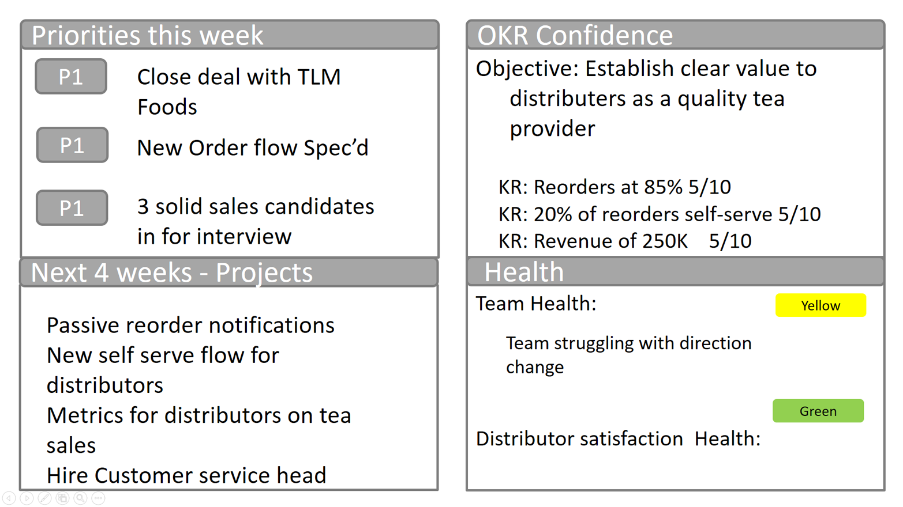
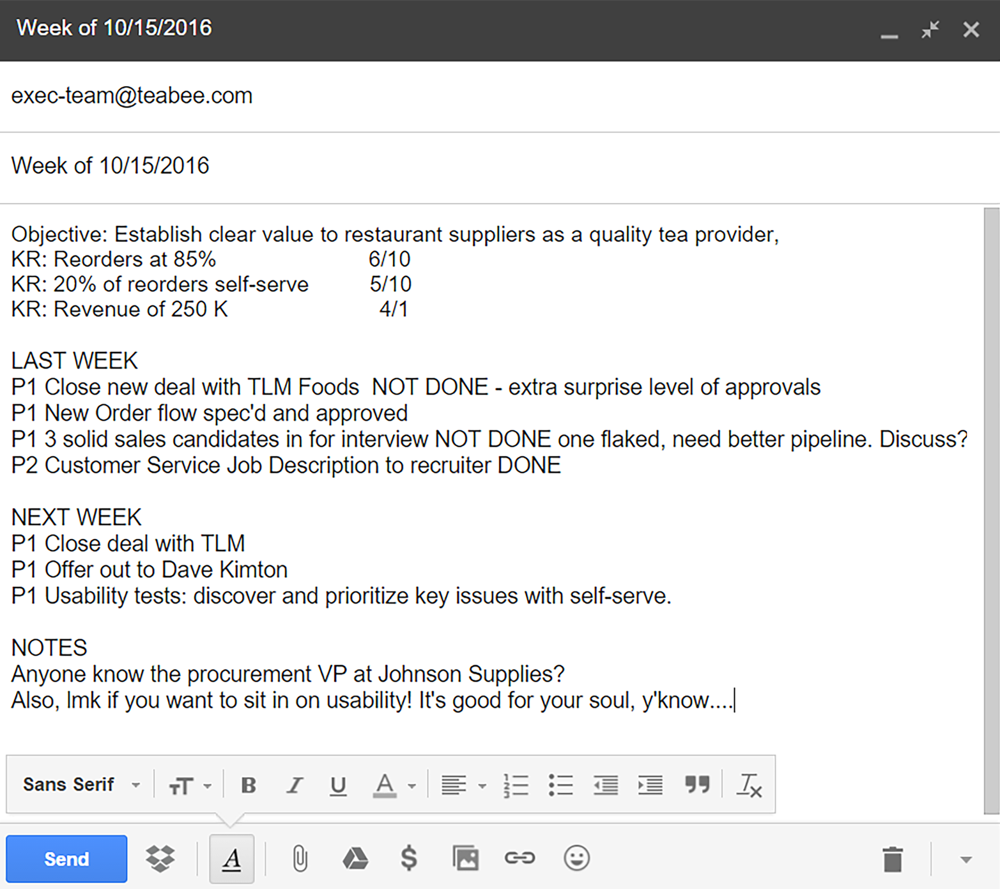
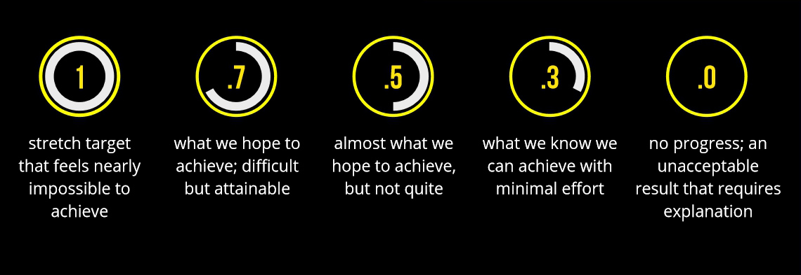
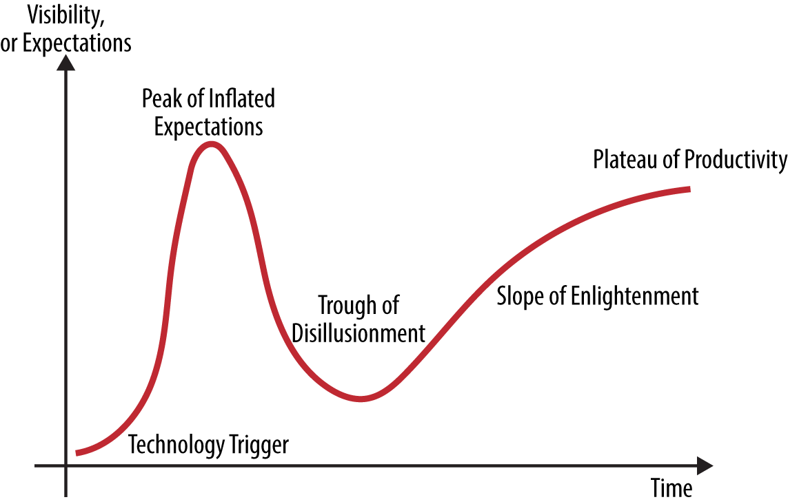

# OKR介绍

**版权说明：** 

作者： Christina Wodtke
Copyright ©  2016 O’Reilly Media, Inc. All rights reserved.

**原始链接：**
由vikaskyadav维护的OReilly免费图书项目
https://vikaskyadav.github.io/Free-OReilly-Books/

**翻译作者：**
[@TopCaver](https://github.com/TopCaver)

**特别声明：**
限于译者的英语水平和技术能力，翻译中必然存在错误，请及时阅读上述链接原文。

| 翻译版本 | 日期       | 贡献者               | 更新说明 |
| -------- | ---------- | -------------------- | -------- |
| 1.0      | 2020-04-06 | ZhangBo（[@TopCaver](https://github.com/TopCaver)） | 新建     |

[TOC]
-----
# 第一章 介绍
为什么人们会对OKR（目标和关键结果）报以如此的热情？说到底，OKR也只是一个目标管理方法。当硅谷的创业团队发现Google、LinkedIn、Twitter和Zynga这些成功的大公司背后都在搞OKR的时候，他们期望通过拥抱OKR，也能获取同样的成功。但这绝非易事，如何有效使用OKR工具，通常需要员工理解他们为了什么而工作。也有许多公司没能成功实施OKR，最后欣然放弃了。

可以肯定的是OKR本身是可以发挥作用，但是为什么不是每个人都能让OKR发挥作用。这里我们将分享顶尖的公司如何使用OKR聚焦重点、统一目标和加速发展。

OKR是一个缩写，但和其他缩写一样，缩写所代表的单词的真正含义经常被遗忘，这种遗忘是致命的。缩写代表的单词的含义，才是这个简单体系能发挥强大功能的真正要义。O：代表目标Objective，你的公司期望达成的目标。KR：代表关键结果Key Results，如何衡量你的目标达成了？哪些数值发生了改变？

如果你期望“生意兴隆”，那你如何定义“兴隆”？用户增长？增长多少？营收增长？增长多少？留存？多长时间？把这些鼓舞人心的口号和可以度量的口号组合成一个规划。它符合SMART原则，且更为简明扼要。每一个员工都可以记住它，并且据此做出抉择。

一个宏伟的目标，是一个强大的工具，但是这还不够。领导者还需要确保组织可以实现这个目标。OKR的强大之处，就是指导团队每天如何向着目标前进。如果将OKR从会议和汇报进一步融入日常或周常的工作中，那么OKR目标能更好的达成。

# 第二章 OKR简史
自从上世纪50年代以来，“管理科学”兴起， 商业领袖吸纳了各种各样的制度来提高公司的效率。彼得·德鲁克（Peter Drucker）介绍了目标管理（MBO，Management by Objectives），MBO的过程是这样的：管理层和员工共同商定一个目标，以及为达目的所需要的工作。

MBO是OKR的前身。管理者设立一个目标，信任他的团队能够完成目标，而不需要管理琐碎细节。这对于工业时代更偏向“控制”式的管理方式相比，是一个巨大而高效的转变。在很多方面，这才是更接近信息时代的管理方式。

在上世纪80年代早期，乔治多兰（George T. Doran） 设计了SMART，SMART和KPI之后成为热门的管理方法，指导组织设定目标。KPI则为公司绩效评估引入了考核指标。广告业流传着一个老梗“我们的广告中有一半是有效的，但我们不知道是哪一半。” 但随着互联网和数据技术的进步，我们现在已经可以知道哪一半是有效的，以及它们怎样影响了KPI。

**SMART**代表着：**Specific**（具体的）、**Measurable**（可衡量的）、**Achievealbe**（可达成的）、**Results-focused**（ 专注结果的）、**Time-bound**（有时间限制的）

后来，这些理念都被引入到OKR中，特别是专注结果和时间限制。

1999年，约翰·杜尔（John Doerr）把OKR这套目标管理方法引入了Google， [这也是他在Intel工作时学到的方法](https://blog.betterworks.com/keys-okr-success-qa-john-doerr/)

>  我最早接触OKR是70年代在英特尔工作时期。那时候，英特尔正在从存储公司向处理器公司转型，Andy Grove和管理团队需要员工专注于高优先级的事项，来确保转型成功。OKR系统的创建带来了巨大的帮助，我们也很欣赏它。我记得我们每个季度设立一个“灯塔”或者“北极星”指引我们排定事情优先级。另外还有一件事，让我非常振奋：我能看到Andy的OKR，我的经理的OKR，我同事的OKR。我可以快速把我的工作方向和公司目标对齐。我将自己的OKR钉在办公室，每个季度写下新的OKR，从那时起OKR就一直伴随着我。

在Grove知名的管理手册《Hight Output Management》（Penguin Random House， 1995）中，他在介绍OKR时，提出了需要回答的两个简单的问题：1）我们要去何方？2）如何确定我们是在朝着那个方向前进？本质上，这是在提问：我们的目标是什么？以及需要关注哪些关键结果才能确保达成目标？OKR就此诞生。

从Google和Zynga开始（杜尔投资并担任顾问），OKR目标管理方法开始在越来越多的公司流行开来：LinkedIn、GoPro、Flipboard、Spotify、Box、Paperless Post、Eventbrite、Edmunds.com、Oracle、Sears、Twitter、GE等等。

## 2.1 什么是OKR
OKR是目标（Objective）和关键结果（Key Results）的缩写。O 是定性的， KR（通常有3个）是定量的。它们通常会聚焦一组或者一个重要目标上。

O设定的目标有一定的期限，通常是一个季度。KR用来在到期时检查O是否达成。

### 2.1.1 Objectives 目标
你的目标应该是一句话，并且应该是：

- **定性的，而且鼓舞人心**

  设定的目标，要能让大家在每天清晨满怀兴奋的醒来。CEO和投资家可能会因为3%的收益而从床上清醒，但普通人的兴奋来源是体会到工作的意义和进展。用团队平时的风格定义目标，如果你的团队平时习惯说些粗话“干死他！”，那就用这种词设立目标。

- **有时间限制的**
  例如可以在一个月或者一个季度干完的事情。每个目标都应该是清晰的冲刺（Sprint），如果他需要耗费一年的时间，你的目标可能是一个战略或者愿景，而不是目标。

- **团队独立完成**
  这对于创业团队没什么问题，但是对于大公司经常需要依赖其他人的工作。但牢记，你的目标就是你的目标，你不能有“市场部不配合，所以我没法完成”这样的借口。

Pusher是一个提供API即服务的创业公司，它们使用OKR加速增长，在回顾第一个OKR时写道（[How We Make OKRs Work](https://blog.pusher.com/make-okrs-work/)）:
> 我们学会了这样一些事情：
> *  不要设定依赖其他团队输入的目标，除非你们商量好了共同的优先级。
> *  不要人还没招到的，就设立一个目标！
> *  对达到目标需要多长时间做到心里有数。

一个目标像是一个使命，只是时间周期更短。一个好的目标，会激励团队，充满挑战（并非不可能完成），可以由设立目标的人独立完成。

下面是一些好的目标：
* 拿下南湾的直营咖啡零售市场。
* 打造一个爆款产品。
* 改变PaloAlto优惠券使用习惯。
* 下季度再来一轮融资。

然后是一些不好的目标的例子：
* 销售增长30%。
* 用户数翻倍。
* B轮融资500万美元。

为什么它们不是好目标？可能它们已经真正的关键结果了。

### 2.1.2 Key Results 关键结果
关键结果是将鼓舞人心的语言进行定量的描述。你可以问自己几个简单的问题：

_我们怎么知道我们达到了目标？目标达成的时候，哪些指标会发生改变？_

这将迫使你定义你所谓的“真棒“，”干掉它“，或者其他黑话。”干的漂亮“是指访问量增长？营收增长？满意度？或者其他各方面的综合指标？

每个目标通常定义三个关键结果。关键结果可以基于任何可以度量的维度。下面这些都可以作为关键结果：

- 增长
- 参与度
- 营收
- 业绩
- 品质

最后一个“品质”可能令人困惑。品质通常很难度量。但是有些方法可以帮助你衡量品质，比如NPS（Net Promoter Score）。NPS是一个分数，它考量的是用户把产品推荐给家人或朋友的意愿。（参考：[“The Only Number You Need to Grow”](https://hbr.org/2003/12/the-one-number-you-need-to-grow). Harvard Business Review, December 2003.)

如果你能明智地选择关键结果，你就可以在增长和性能，或者营收和品质之前取得平衡，只要确保你有相互制约的两方面衡量指标即可。

在《Work Rules！》里，Laszlo Bock也提到过：
> 同时考核质量和效率两个方面非常重要，否则工程师通常会牺牲一个指标来达成另外一个指标。如果系统需要运行三分钟才能输出正确结果，那也是需要改进的。我们需要兼顾正确和速度。

就拿“打造一个爆款产品”这个目标来说，会对应下面几个关键结果：
- 40%的用户是每周使用两次
- 推荐评分达到8分
- 50%的转化率

注意到这些有多难达成了么？

**关键结果KR应该富有挑战，但也不能是完全不可完成的**

OKR永远追求更高的目标。一个方法是为OKR设个10分制的信心指数，5表示”我有50%的信心完成任务“，1则表示，”需要神仙帮忙“。

设置KR的时候，你应该寻找那些可以推动自己和团队取得更大成就的事情，但也不可能完成的任务。我认为只有一半一半的信心指数的事情最为合适。

信心指数到达10分，则表示：”没问题，马上搞定。“ 这就意味着你设立的目标太低了，通常被喻为”沙包挑战“。在惩罚失败的公司里， 员工很快就会学会拒绝挑战。如果你希望取得更大的成就，那就要为员工挑战更高目标打造一个心理感到安全的氛围。

看一眼你的KR。如果你的感觉是”我们必须全力以赴才能达成“，这样才是合适的；如果感觉”完全没戏“这个就是太难了；如果”问题不大“，那可能又太简单了。

## 2.2 为什么使用OKR
orks.com的创始人Ben lamorte讲了这样一个故事：
> 我的导师Jeff Walker，带着我学习OKR，一次他问我：你去徒步的时候，有目的地么？我愣了一下，不明白他的意思，Jeff接着说：你和家人去旅行的时候，可以随便走走看看沿途的风光，这没什么问题；但是如果是在工作，那你必须清楚你的目标；否则，你就在浪费你的自己的时间，我的时间，我们所有人的时间。

OKR就是要为团队设立一个目标，来确保没人浪费时间。

选择OKR的企业，通常有三方面考量：
- 专注（Focus）：我们做什么，和我们不做什么？
- 一致（Alignment）：如何确保上下一致在最重要的事情上？
- 激发潜能（Acceleration）：你的团队已经将潜能发挥出来了么？

### 2.2.1 专注
社交游戏公司Duxter，采用OKR解决创业团队的典型问题：新奇事物综合症。CEO Adam Lieb这样写道：
> 和所有创业公司一样，我们为最重要的事情努力工作，但我们面临两个问题：第一是，哪个是更重要的事情，通常大家有不一致的看法。这种观念差异将导致冲突和低效。
>
> 第二， 我们的“最重要的事情”每周甚至每天都会变。这让公司内的所有人感到困惑，不知知道自己的精力应该集中在哪里。
>
> 引入OKR帮助我们改善了这两个问题。

### 2.2.2 一致
在一次采访中， Dock Costolo，前Google员工兼前Twitter CEO，被问及哪些东西被他从Google带到了Twitter？他说：
> 从Google带到Twitter的是OKR。这是一个重要的工具，帮助公司里的每一个人都能理解什么是“重要”的，以及“如何度量”重要的事情。本质上，是一个沟通方式和评价方式。这也涉及到如何使用OKR。随着公司规模的扩大，最困难的就是沟通。OKR是一个很好的方式，确保每个人都能理解公司如何衡量成功。

在团结公司方面，OKR通常比KPI更加有效，因为它结合了定性的和定量的目标。鼓舞人心的目标O，将会激发那些度量指标少的岗位，如设计师和客服。KR会让数字驱动的岗位找到归属感，例如审计和销售。因此OKR会把整个企业团结到一个核心目标上。

### 2.2.3 激发潜能
来自 Re:Work 网站的一段话, re:Work是 [Google的OKRs官方指南](https://rework.withgoogle.com/guides/set-goals-with-okrs/steps/introduction/) :

> Google通常设立一些刚好超越能力的目标，有时称为“扩展目标”。设置不可能完成的目标，通常是一件很棘手的事情，因为人们可能会视为故意找茬儿。但更多的时候，这类目标反而会吸引更优秀的人，创造出振奋人心的工作氛围。另外，如果目标设的很高，那即使最后失败了，那最终失败的结果也还是一个很不错的结果。

这清晰地揭示了扩展目标的本质和成功的阈值。 在Google设置OKR，70%完成就是成功的 ，100%完成被认为是杰出的绩效。

长期看来，这类扩展目标，是取得杰出绩效的基石。

由于OKR永远都存在扩展目标，所以是在持续鼓励员工不断地拓展自己的边界。你永远都不知道自己的能力极限在哪里，直到你开始了“登月计划”。

说到这里，这已经OKR最奇妙的部分了。 用一个《星际迷航》的段子来说：Scottie总是说“”发动机不行了“，但是他总能使发动机继续运转。

Geordie会说，”发动机熄火之前，你还有五分钟时间“。如果他有解决方法他会告诉你，但你应该知道早做准备。

作为舰长，你是希望出现一个英雄，还是希望出现一个真正知道团队做什么的人？我很清楚我自己的选择。

如果你讲OKR和绩效考核、奖金关联起来。员工将永远低估自己的能力。因为将目标设立的太高，一旦无法达到就将十分危险。如果你鼓励大胆的OKR，然后根据最后的实际表现来做绩效考评，那么员工将通过他们取得的成绩，而不是通过隐瞒能力而得到奖励。

毕竟，在登月的过程中，有时我们会得到Tang，Sharpies，Velcro这样的人才，这些难道不该奖励么？

## 2.3 实施OKR
有些尝试OKR的公司最后失败了， 他们把它归咎于这套系统。 但是你不真正用起来，什么体系都不会自己成功。设置目标，等到季度末奇迹般的达成，这怎么可能。定期回顾同样十分重要。

Scrum是一个工程师经常使用的敏捷方法，用来对进度作出承诺，使团队成员间互相信赖彼此支持。每周，工程师分享上周发生的事情，说明接下来要做的工作，指出阻碍他们达成目标的事情。在更大的组织中，他们还会组织一个“Scrum of Scums”来确保不同的团队之间可以达成共同的目标。

### 2.3.1 周一计划
每周一，团队应该检查一下OKR的进度，计划一下本周完成的任务，以帮助企业完成目标。我建议推荐四象限方式：
- 当周计划：
  为了达到目标，本周必须完成的3～4件事？讨论一下这些重要的事情是否使你离目标更近了。

- 月度展望：
  接下来，你需要为哪些事情做准备？

- OKR状态：
  如果你设置了一个信心指数，那现在是信心更足了，还是感觉困难更大了？讨论过为什么会这样么？是什么事情阻碍了你达成OKR？

- 健康度量
  选两个你誓死捍卫的事情，你无法容忍的是什么？与重要客户的关系？代码稳定？团队产出？当发现出岔子的时候，及时发现和讨论这些事情。

  

  

这份文档是第一个也是最后一个交流工具。你可以这样讨论这些问题：

- 这些重要的事情可以引领我们达成OKR？
- 为什么我们信心下降了？谁能帮助我们？
- 我们准备好再做一件大事了么？市场知道接下来会有什么产品面世么？
- 我们是否已经精疲力尽或者代码已经混入了坏味道？

在讨论时，可以只关注着四个象限。或者也可以使用它做一个状态总览。然后用其他更细节的文档覆盖度量、项目流水线、相关更新等等。每个公司对会议的态度都稍有差别。

尽量让事情保持简单明了。很多类似进度跟踪会议上是团队成员把完成的每一件小事都列了出来。你要相信你的团队在日常工作中能够作出明智的选择。会议的存在主要是为了团队成员互相帮助来达到共同的目标。

更少的重要事项，更简短的更新。

为会议预留的时间，如果1/4用来展示，3/4用来讨论接下来做什么，那么就是合适的。如果能更早的结束会议就更好了。不是说一定用完全部的会议时间。

LindedIn的CEO，Jeff Weiner有一些特别的方法。他使用“胜利大法”为会议提前预热。在讨论指标或者业务之前，他先在办公室走一圈，询问每一个下属，他们上一周取得的“胜利”和“成就”。让大家在严肃讨论KR为什么可能无法完成之前，先有一个积极的心态。

### 2.3.2 周五庆祝

当团队设立一个很高的目标时，通常会失败。虽然目标高远是件好事，但是总是无法达成目标，也不知道自己走了多远，这就很让人泄气了。所以周五的回顾环节就很重要了。

在周五，团队要尽可能的展示自己的成绩，工程师展示他们写的代码， 设计师展示飞机稿和设计图。每一个团队都应该展示一些东西。销售可以讲讲他们签下的订单，客服可以讲讲他们服务的客户，BD可以分享一些达成的交易。这样做的好处是：第一，你会感受到自己是这个成功团队中的一员。第二，团队开始期待分享，就会努力达成目标。最后，公司能关注到团队和成员每天都在做什么。

会议上可以提供啤酒饮料矿泉水，花生瓜子火腿肠，让你的团队成员感受到组织的温暖也很重要。如果团队实在太小没什么可以提供的，也可以众筹一些奖励让大家可以共同参与。但是公司大了，应该为此设置专门的预算。这样想：优秀的员工是公司最重要的资产，难道不应该为此投资么？

OKR是一个很好的设置目标的工具，但是单纯只有OKR而确实完整的体系，OKR也会像其他流行的过程一样以失败告终。为团队承诺，为队友承诺，为未来承诺。然后每周回顾一下这些承诺。

# 第三章 如何举办季度会议设置OKR

设置OKR是件难事。它依赖你对公司的评估，以及对公司未来发展方向的抉择。确保结构化的会议会得到好的结果。才能顺利把OKR带入下一个季度。

举办小型会议——尽量不超过10个人。他应该由CEO发起，包括高管团队。拿走手机和电脑，让人们专注于会议内容。

在会议开始前的几天，收集所有员工对公司目标的意见。确保他们在一个很小的时间窗口完成，24小时即可。你不想让这个过程太慢，对于繁忙的公司来说，“稍后”就是“算了”。

指定一个人（顾问，或者部门领导）收集并提出最好的和最受热门的目标。

预留四个半小时的会议时间：两个小时一场，中场休息30分钟。

你的目标：取消下半场的会议。集中精力。

每一个参会的管理者的脑海里应该有一两个目标，带着目标来开会。员工提出的目标写在便利贴上，主管再添上他们的内容。建议写得大一些，写的太小影响阅读。

之后，让团队把便利贴贴到墙上。合并相同目标，寻找出背后共通的一些问题。合并类似的目标。最后，把目标缩小到三个目标。

讨论、争辩、斗争、归并、打分、再挑选。

根据团队的规模，要么搞到中场休息、要么还能省出一个小时。

下一步，所有管理团队成员，尽量多的列出可以衡量的指标。“自由列表（freelist）”是一种思考设计的方法：简单记下尽量多的想法，每一张小条写一个想法，这样方便你重排、丢弃、再处理你想到的这些想法。

这是一个非常有效的头脑风暴的方式， 它会带来诸多不同的好想法。这个环节超时一些时间也是可以的，10分钟左右，毕竟你更期望得到更多更有意思的想法。

下一步，合并同类项。把相似的指标小条合并成为一组。例如，两个人都写了日活数（DAU），你可以把这些叠放到一起，这样DAU就有两票了。MAU（月活）、WAU（周活）都是衡量用户参与度指标，把它们依次整理到旁边。最后，你可以选择三种不同类型的评价指标。

写下KR，先不用写具体数字，用X代替即可：X收入、X收购、或者 X DAU。这样方便先讨论衡量那些指标，然后再讨论具体的值。即便你的目标是登月，也要这样一步步来。

根据经验，我建议你制定惯用的指标，一个收入指标，一个满意度指标。但是明显这不会适合你所有的目标。你要寻找不同的衡量成功的方式，以保证这种成功可以跨季度的实现。例如，假如设置两个收入指标，你可能会引到使用失衡的方法骗取成功。过于关注收入指标，会引导员工欺骗评价体系，使用损害用户长期利益的方法，提高短期收入。

下一步，设置KR具体的值。确保这些值确实有助于你“登月”计划成功。应该保持5分的信心指数。互相评价这些KR，是不是有些是沙包？有些过于安全？有些过于勉强？利用这个时间扯皮这些指标，不要季度过半的时候，再扯皮这些数字。

最后，利用五分钟时间，讨论最终的OKR。O是不是积极向上鼓舞人心？KR确实有意义？它们是不是很难？你能忍受他们一个季度么？

调整好，直到你感觉正确了，然后为之奋斗。

你可以从http://eleganthack.com/an-okr-worksheet 获取一个工作表。

# 第四章 使用OKR改进每周进度汇报邮件

还记得我第一次写进度汇报邮件，那是2000年，在Yahoo我刚被提升为经理，管理一个小团队。有人告诉我“你每周五要写一封邮件，汇报你们小组一周的工作”。好吧，你能理解这种感受。我必须证明我的团队正在完成工作。不仅仅要证明存在的价值，还要证明我们需要更多的人。因为，是吧，更多的人，你懂的。

我像每个人一样：事无巨细的列举我完成的工作，那是一篇基本没法读的汇报。然后发给我的领导们。（其中一个领导善意提醒我在开头写一个摘要）

之后的几份工作我也一直这么写，顶多是精炼一些而已。直到后来有一次，我决定不写了。那时候我们有了专职的项目管理经理，我的下属会把进展直接发给我们的项目管理经理，他汇总之后发给我，我看过之后再发给我的老板。有一次我忘了这件事了，然后谁也没说什么。原来这件事，根本就没人在乎，纯粹就是在浪费所有人的时间。

2010年的时候，我加入Zynga。Zynga在一些关键的事情上做的非常好，确保业务运转正常。其中之一就是进度报告。所有的报告都会发到管理团队，我很喜欢阅读这些报告。对，是的，我很喜欢看。为什么？因为他们用易于理解的形式列举了重要的信息。让我可以明白，我需要做什么。在早期，Zynga相比于其他公司发展更快。我认为这种有效沟通发挥了很大的作用。

离开Zynga之后，我开始从事一些咨询工作。我调整进度汇报邮件以适应不同的合作伙伴，从敏捷实践中获得了一些小窍门。现在我有一个简单实用的格式，可以适用于不同的组织，无论大小。

1. 以团队OKR开头，当前还有多少信心完成他们。列出OKR提醒团队成员（包括自己）为什么要做这些事情。你的信心指数是能达成KR的一个预估。从1到10。小于3为红色，大于7为绿色。颜色可以帮助你们快速浏览了解情况。把信心指数列出来，不但可以追踪进度，还提早发现问题。

2. 列出上周的重要工作是否完成。如果没有完成，简要解释一下原因。可以参考下面的例子。

3. 列举下周的重要工作。只列出3个P1级别的事情，他们应该是充实的，包含诸多工作步骤的事情。比如，“确定xeno项目的最终范围”就是一个好的P1事件。它可能包括编写、评审、沟通、最后才能确定下来。他还会提醒你的老板和相关团队，你近期准备要来找他们沟通了。“和法务聊聊”就不是一个好的P1事件。这件事顶多需要半个小时，也没有什么明确的产出，更像是一个子任务。何况还没说要聊些什么。你也可以补充一些P2级别的工作，但这些工作同样应该是完整充实的。

4. 列出风险和阻碍。就像敏捷站会，遇到自己解决不了的问题，就寻求帮助。不要抱怨和责备，你的领导不会想你慈祥善良的母亲一样，听你唠唠叨叨的吐槽完，再说些什么“不怪你，是他的错。”之类的话。 而且，列出风险和阻碍，你的老板也可以早做打算。老板们不喜欢“惊喜”。所以不要给他们“惊喜”。

5. 附注。写在最后，如果有些不方便分类，又非写不可的事情，可以添加一些附注。“感谢我们招到了来自亚马逊的大牛”是个不错的附注，“提醒：周五球队有比赛。” 确保这些提示真的有用，别写太长。附注可不是借口、鸡汤和小说的写作练习。

   

这个格式还解决了一些大型组织面临的问题：协作。之前每周五的进度汇报，我要周四晚上就要收集整理团队的进度，核对这些进展，编辑好文字。但是用现在这种方式，我知道我的重要关注事项是什么，进度汇报只用确认下下属的重要事项和我预期的一样。我周五能收到汇报，随后就能发出我的汇报。互相之间相互信任，保持专注。

工作不应该是一个琐碎的代办列表，而是引领团队前进不断实现的共同目标。汇报邮件理应提醒每个人这个事实，不要陷入勾选复选框的思维。

协调组织有效工作对提升公司竞争力和创新能力至关重要。因此，放弃汇报邮件也是不明智的。它可能是一个浪费时间的工作，但也可以成为一个团队互相联系互相支撑的有效沟通方式。

## 4.1 跟踪和评估OKR

在每个季度结束前的两周，需要对你的OKR进行打分，并计划下一轮OKR。毕竟，你是准备第二季度的第一天开始工作，对吧？

这里有两套常用的体系管理OKR：信心指数和计算评分。各有千秋。我们先说信心指数，之前我们提到过这个方法。信心指数是一个简单的方法，适用于初创团队或者小团队，或者是刚刚开始实行OKR的团队。当你设定了你的O和3个KR，也已经设置了5分的信心指数。通常以5/10的方式表示信心指数。

在周一例会上，每个人会报告他们的信心指数是否发生了变化。这不是精准的科学，这是门艺术。你不希望浪费时间在如何通过计算得到的准确信心指数；你要找确保方向还是正确的就行了。在最初的几周OKR中，可能很难为你的KR标识进度。但是你在第三周或者第四周的时候，就能知道你离初定的KR是近了，还是远了。这个时候，团队的领导（或者小团队的全部成员）就可以调整信心指数，让它符合切身感受了。

之后，随着“解决了问题”和“又出了新问题”，这个信心指数会疯狂的上下波动。最终，在两个月的时候， 信心值将确定出可能的结果。在季度末的最后两周，你通常可以确认OKR的结果了。如果当初评估它确实是一个有挑战的工作，完成的概率只有一半一半的话，在最后的两周，通常也不会出现奇迹。所以早一些确认OKR的结果，就可以早一些计划下一季度的OKR，并且开始新一轮的工作。

这种方法的优点有两个。首先，团队不会忘掉OKR。因为他们需要去更新这个信心指数。因为信心指数是一个直觉，可以快速评分，也不怎么痛苦，这是帮助新团队建立习惯跟踪OKR的关键。第二个好处是，会引出一些关键性的讨论。当信心指数下降的时候，会引发思考：为什么会发生这样的情况？然后集思广益想办法解决问题。OKR是出自整个团队也是属于整个团队的，因此任何团队成员遇到的困难，都是整个团队的困难。团队领导要让团队知道当信心指数下滑的时候，是要有人挺身而出的。

在季度末的最后两周，你的信心指数要么是10，要么是0。如果三个KR中达成了两个，则意味着O达成了。这会让人为可能的目标加倍努力，而放弃确实无法完成的目标。这样做的好处是，阻止人们在不可能的事情上过多的耗费精力，专注于可以完成的事情上。但是，不利的影响是，有些人会设定一个不可能的目标，一个困难的目标，一个简单的目标。管理者要警惕这一点。

另外一个评价OKR的方法是计算评分。google使用这种方法。在季度末的时候，团队和个人通过收集数据对结果进行评分。0.0表示失败，1.0表示完胜，大多数结果位于0.6～0.7这个区间。以下来自Google OKR的站点，ReWork：

> OKR 的最佳位置在60～70%之间。分数太低意味着没有取得足够的成就，太高意味着挑战不够。在google 0.0～1.0的区间内，所有OKR的区间平均预期都是0.6～0.7。对于初入OKR的组织，本身就很难“宽容”这中对失败的宽容。

Ben Lamorte是一个大型组织的OKR教练。他通常使用评分制而不是信心指数。下面摘自他的文章 [《A Brief History of Scoring Objectives and Key Results》](https://www.linkedin.com/pulse/brief-history-scoring-objectives-key-results-okrs-ben-lamorte/)  :

> 作为OKR教练，我发现大部分组织会对关键结果进行打分，或者在季度末或者在中间进行多次评分。但是评分本身又不是关键结果。如果你期望使用标准化的评分体系，那你的关键结果的定义就应该包含这些分数。但是在有些情况下，KR没有确定，0.3或者0.7怎么定义也不是很清楚，除非我们把0.3和0.7能描述清楚。

我为我的客户设计了这样一个评分指南

1.0 - 夸张的目标，不可能达到的；0.7 - 很难，但我们应该能努力达成的；0.5 - 没有十足把握，但是差不多应该可以；0.3 - 没问题，我们可以的； 0.0 - 没有进展，或者结果不可接受的。

下面这个例子展示如何为关键结果设定分数。

KR： 第三季度推出新产品ABC，并获得10个活跃用户。

0.3分 = 产品原型经过三个内部用户试用

0.7分 = 产品原型经过测试并批准在第四季度上市

1.0分 = 产品上市并获得10个用户

这是强迫人们探讨理想与现实。工程团队可能会告诉你0.3分都是非常困难的。在敲定KR之前，进行这些讨论，确保每个人都在同一个标准下开始工作。

除了精确，Google通常也是高度透明的。所有的OKR，个人的和团队的都被放到内网上，团队共享他们的进展。同样，来自ReWork：

>  对组织进行公开的OKR评分。在Google， 组织OKR通常季度和年度的分享和评分。在新年伊始，公司范围的会议会对之前一年的OKR评分，然后分享新的年度OKR和季度OKR。然后每个季度进行回顾、评分、设立新OKR。在这些公司会议上，每个OKR的责任人（通常是团队领导）说明评分，和下一个季度的调整。

也是ReWork上：不要忘记设置/遗忘的风险：

> 过程中检查。在给出最终评分之前，设置一个中期检查会比较好，这将帮助个人和组织认识到他们所处的位置。在季度结束的时候，就会对最终结果有一个预期。

不同的团队也会有所不同。有些中期检查就像期中考试一样。 而Google则一向奉行“招聪明的人，设立一个目标，让他们自己完成”。OKR的具体实施也是各有不同，不过OKR包容这种存在即合理的哲学。

Ben Lamort同样分享了一个简单方法，让OKR进度可视化：进度海报。他的几个客户设置了这种进度走廊，时常更新进度。这不仅是OKR更加透明并且让所有团队都可以看到，还是一种有效的KR评分的沟通机制，增强责任心。如果一个月过去了，你的团队没有更新进度，那看起来就不那么好看了。大部分的进度海报在每个季度定期更新4到8次。 OKR当然不可能适用于所有组织，但是有些时候确实非常见效。

无论是适用信心指数，还是正式的计算评分（或者两者结合），这里有最后一条来自ReWork的建议：记住这一点：

> OKR不是绩效评估的代名词。这意味着OKR不是用来评估组织和个人。相反，它可以用来展示个人在之前一段时间的工作，以及为组织做出的贡献。

使用每个人的成就来确定奖金和加薪。如果你使用某种汇报机制，那员工个人应该可以很方便回顾他们的工作，写出他们已完成工作的摘要。这个报告可以指导你的绩效面谈。有些事情不应是自动化的，最重要的部分对于经理来说是和员工真诚的沟通，哪些是他们已经取得的成就，哪些还没有。

如果你只依赖OKR的报表来做出奖惩决定，那么你可能在奖励不思进取的人，而惩罚追求进步的人。奖励实际贡献，而不是奖励系统上的指标。

### 4.1.1 OKR软件使用提示

当你选择解决方案的时候，你首先考虑的是什么？想减肥？买个昂贵的跑步机。想开始跑步？买一双跑鞋。计划节食？先买一个最准的称。或者买它15本减肥书。可笑么？不幸的是，OKR也是这样的。人们想通过购买软件，来完成目标管理。

OKR的软件在市场上俯拾皆是，有些确实不错。但是购买软件应该是你的最后一步，而不是第一步。采取OKR的正确的方法是从轻量级的方法开始，然后尝试不同的方法，直到找到最佳实践。

尝试从这些工具开始吧：

- 白板，写出你的目标。
- 便利贴，头脑风暴出好的KR
- PPT/Keynote，跟踪目标的信心指数
- Email，发送进展
- Excel，如果你决定要进行正式的评分。（Google在其网站[ReWork](https://rework.withgoogle.com)提供了一个打分工具)

在你感觉自己真正掌握了OKR之后，再去买软件。

# 第五章 开始OKR
和其他新技术一样，管理方法也有炒作周期。OKR也不例外；我认识许多人，他们对OKR心灰意冷，不愿意再次尝试OKR。但是就像精益和敏捷，一些公司没有取得成功，不能认为这些方法本身没有价值。

有些公司第一次听说OKR的时候，他们非常兴奋。

“现在，我知道成功的秘诀了！”然后在整个公司推广OKR。通常管理者会认为自己找到了万能钥匙。Gartner很好的描述了这种感受，称之为[“炒作曲线”](https://www.gartner.com/en/research/methodologies/gartner-hype-cycle)

但是，第一次尝试OKR，你可能会失败。虽然OKR并不复杂，但它很难实施而且通常需要观念上的改变。失败是非常危险的，因为你的团队会感觉沮丧，并且拒绝再试一次。你不想因为需要付出些时间才能掌握好OKR，就失去这样一个有力的工具。

有三个方法，帮助你降低风险：

- 近从公司单一OKR开始

  为公司设置一个简单目标，你的团队可以看到管理层高标准的执行。下一个季度在团队推广执行的时候，就不会感到意外了。也不要进行级联，这样你可以降低实施难度，又可以看到谁选择了OKR，还是需要额外的帮助。

- 在整个公司之前，先让团队使用OKR

  选择一个具备达成目标能力的独立团队。你可以在首轮成功时进行宣传，或者等一两轮之后，找到完善的实践方式，再将OKR推广到全公司。

- 在项目层面开始OKR，培训员工掌握目标-结果的工作方法

  GathContent是一个很好的例子。每次重大项目开始前，都先问这个项目的目标是什么？我们怎么知道自己成功了。（这个案例在我的新书《Radical Focus》中有介绍） 

在所有这些方法中，都要避免OKR出现致命错误，集中关注哪些方法才合适你的企业文化。从小的OKR做起，跟踪OKR如何在您的组织中工作，提升团队接受这种结果导向的工作方法，降低全军覆没的风险。

OKR不是万能的。他是一套组织方法论。它的存在是为了创造一个焦点，以提升员工成就感和生产力。精益、敏捷，在结合上强大的管理工具OKR，将帮助你摆脱幻想，切实提高生产力。

## 5.1 使用OKR的提示

- 仅为公司设置一个OKR，除非您有多个业务线。保持专注。
- 给自己三个月时间，以使OKR产生效果。难道您一周之内就能做到？
- 让目标摆脱度量指标。目标是用来鼓舞人心的。
- 每周例会时，对照公司OKR小组进行回顾。不用每个员工逐一检查；面对面的OKR回顾最好私下进行，你每个星期都做，是吧？
- OKR级联；设置公司的OKR，然后设置组/角色，然后是个人。
- OKR不是您要做的全部事情；它们是你必须要做的事。相信人们可以正确工作，不要每项任务都挤入OKR。
- 星期一OKR回顾也是讨论沟通。讨论影响信心指数，健康指标和优先级的变化。
- 鼓励员工对公司的OKR提出建议。OKR是可以自下而上的，而不仅仅是自上而下。
- 公开OKR。Google已经把它们放在了自己的内网上。
- 周五的庆祝活动是为了缓解周一严肃的气氛。总之，保持乐观！

# 关于作者
**Christina Wodtke** 致力于帮助企业从愿景转变为执行力，Wodtke Consulting的负责人，在加州艺术学院和斯坦福大学继续教育中培训新一代企业家。

克里斯蒂娜（Christina）领导了此类产品的重新设计和初始产品，包括LinkedIn，Myspace，Zynga，Yahoo！，Hot Studio和eGreeting。她创立了两家咨询初创公司：一种产品初创公司和在线设计杂志Boxes and Arrows；和她与人共同创立了信息架构研究所。她是《101 Theses on Design》, 《Information Architecture: Blueprints for the Web》的作者，她的新书是关于OKR的《Radical Focus》。

她的演讲遍布会议、大学、董事会，观点也遍布互联网，通常发表在 Eleganthack.com。